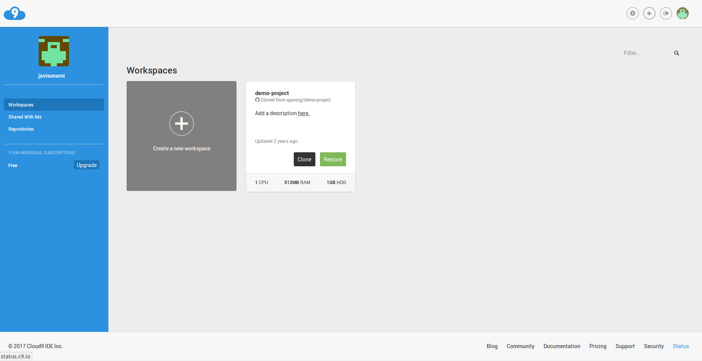

# Cloud9

## ¿Qué es Cloud9?
Es un Integrated Development Environment (**IDE**) para desarrollo que tiene como plataforma la nube.

## ¿Cómo se utiliza Cloud9?
Lo primero que debemos hacer para utilizar Cloud9 es crearnos una cuenta. Para ello vamos a su [página oficial ](https://c9.io/).

Una vez que hemos creado la cuenta veremos una ventana como la siguiente:

A continuación, para poder empezar a trabajar, es necesario crear un espacio de trabajo. Para ello vamos a la pestaña **Create a new workspace**.
