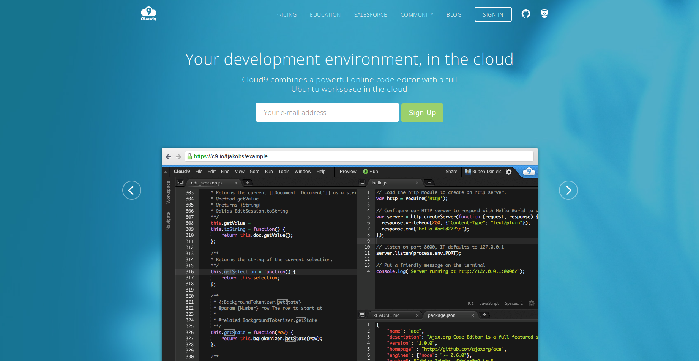
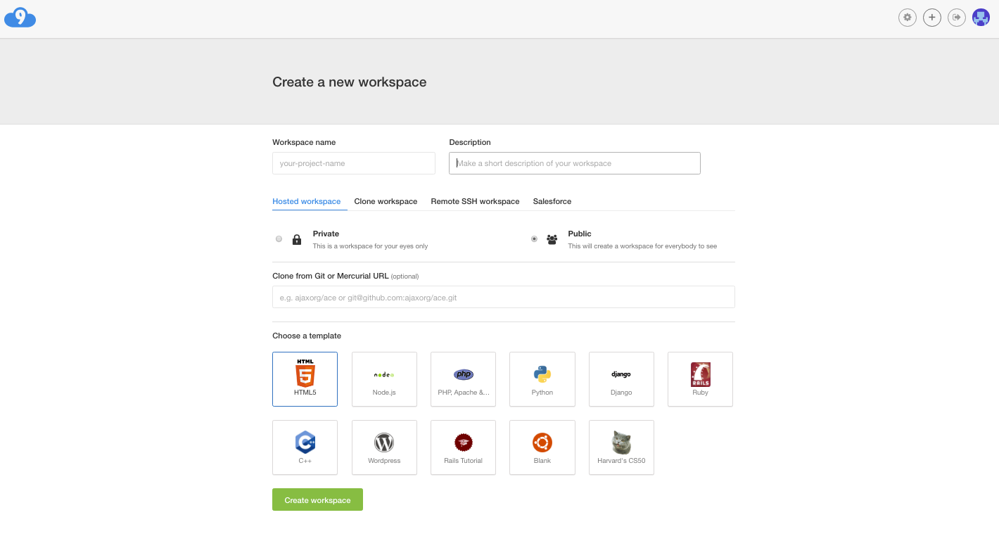

# Cloud9

## ¿Qué es Cloud9?
Es un Integrated Development Environment (**IDE**) para desarrollo que tiene como plataforma la nube.

## ¿Cómo se utiliza Cloud9?
Lo primero que debemos hacer para utilizar Cloud9 es crearnos una cuenta. Para ello vamos a su [página oficial ](https://c9.io/).

Una vez que hemos creado la cuenta veremos una ventana como la siguiente:

A continuación, para poder empezar a trabajar, es necesario crear un espacio de trabajo. Para ello vamos a la pestaña **Create a new workspace**.

Las opciones básicas de configuración del *workspace* nos permiten establecerlo como
**privado o público** y elegir una **plantilla**.

## Workspace

El **workspace** se corresponde con nuestra área de trabajo. En ella, tal y como se puede apreciar en la siguiente imagen, podemos crear documentos, carpetas, abrir ficheros e incluso una terminal.

El sistema operativo que usa Cloud9 es  `Ubuntu 14.04.5 LTS`, tal y como podemos apreciar al ejecutar el comando `lsb_release -d`. Es por ello que
desde la terminal podemos ejecutar todos los comandos propios de esta distribución de Linux, así como instalar
programas a través de su gestor de paquetes.
